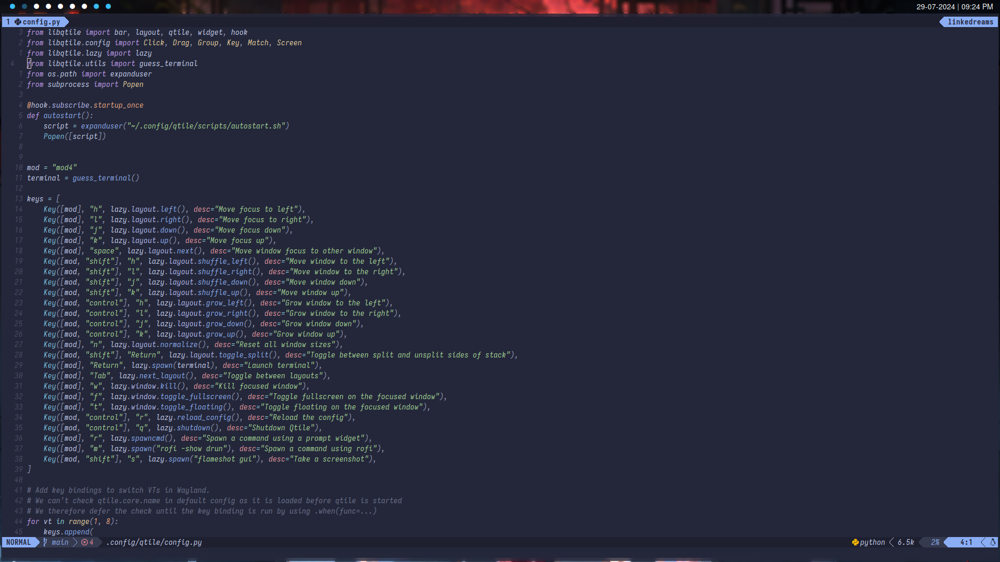
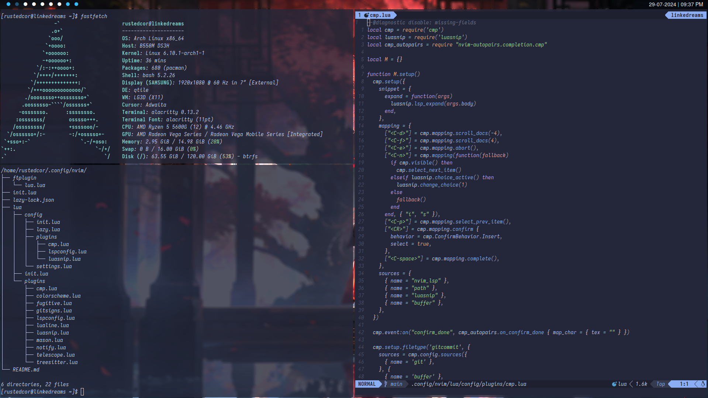

# QTileWM X11 Rice

## SCREENSHOTS

### Advice
You ***should*** ignore my wallpaper, ***it's just a picture*** I enjoy looking at, but ***it's not a reflection of who I am.***

### Qtile Keymap example

### A sneak peek of my neovim setup

## Packages
- Qtile (I may add Qtile-extras to this project soon)
- Alacritty (The configuration files are in another repository)
- xorg-xrandr (screen resolution, more info in `nano ~/.config/qtile/scripts/autostart.sh`)
- Rofi (Will be customized in the future)
- Picom-git (with glx backend, You must install it from ***AUR***)
- Nitrogen (you must download and set the wallpaper manually)
- NerdFonts (I use Iosevka Nerd Font `sudo pacman -S ttf-iosevkaterm-nerd ttf-nerd-fonts-symbols` but I wanna change all the icons and the Qtile bar ASAP, maybe polybar)
- LightDM (Will be customized soon)

## Only Qtile installation

1. Install Qtile and fonts from pacman
`sudo pacman -S qtile ttf-iosevkaterm-nerd ttf-nerd-fonts-symbols`
you can use every font you want, but you must install NerdFonts symbols
2. Clone the repository
`git clone https://github.com/RustedCor/RC-Qtile.git`
3. Delete actual Qtile configuration
`rm -rf ~/.config/qtile`
4. Copy the configuration files to the Qtile directory
`mv ./RC-Qtile ~/.config/qtile`
5. Set the wallpaper with Nitrogen
`nitrogen ~/path/to/wallpaper --set-auto --save`
6. Restart Qtile pressing `Mod + Control + R`
7. Maybe you need to restart your computer to apply picom changes, especially fonts and picom config
